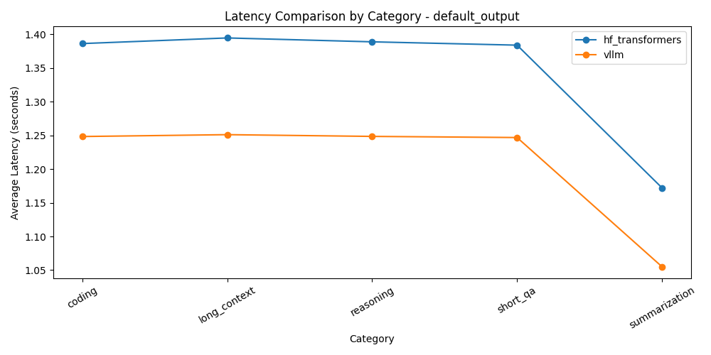
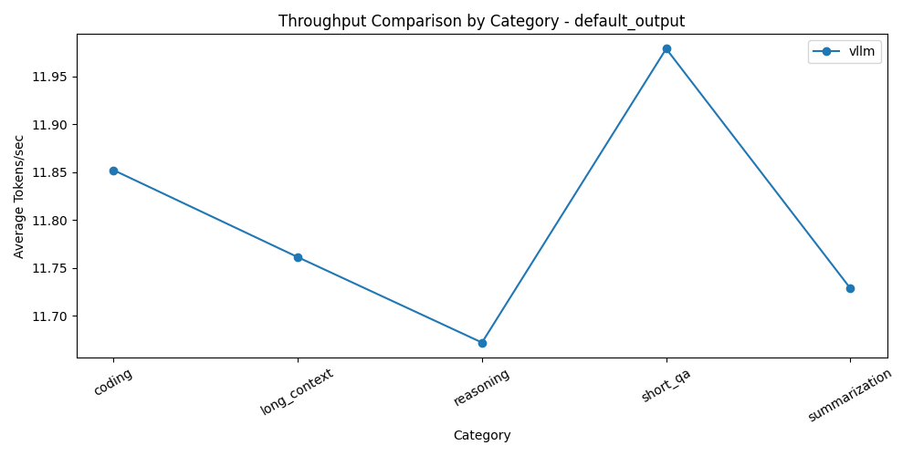
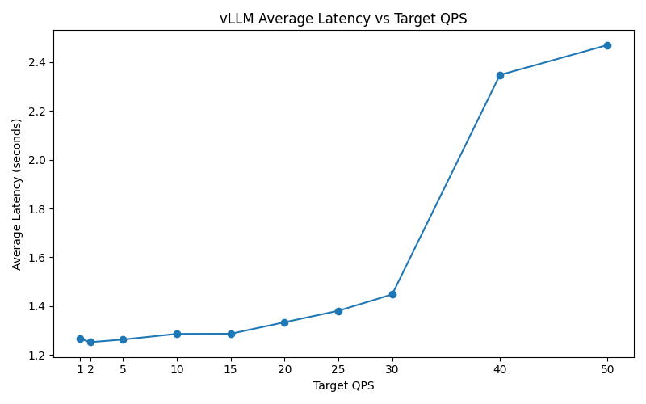
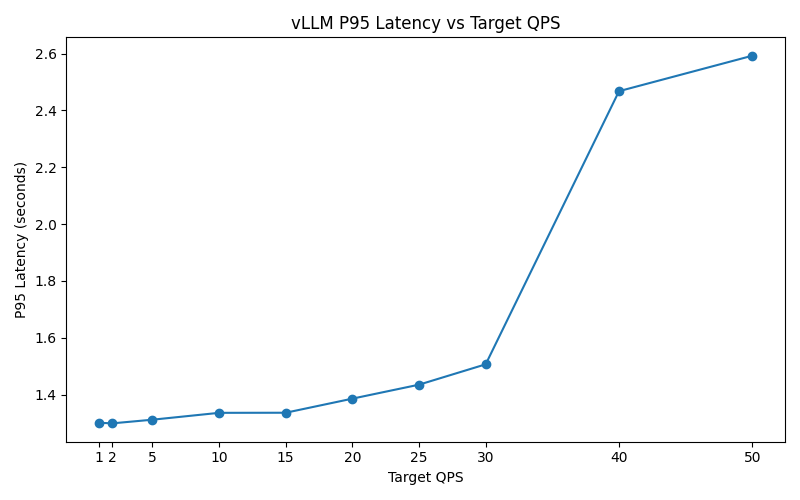
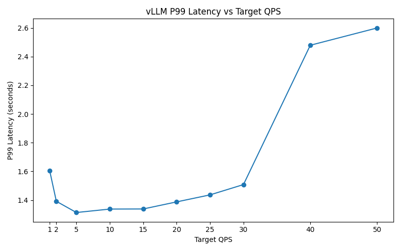
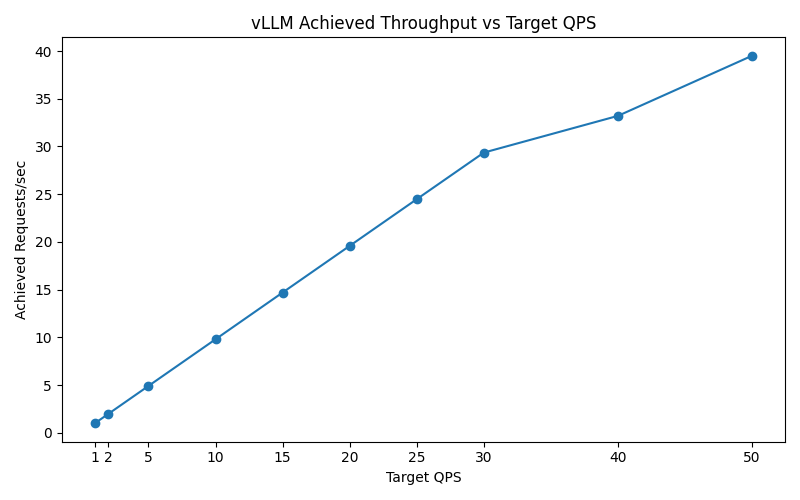
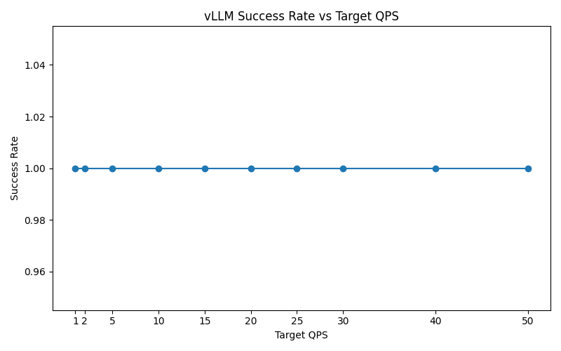

# LLM Inference Optimization and Benchmarking on NVIDIA GPUs

A reproducible benchmarking framework for comparing modern LLM inference engines across latency, throughput, and system-level behavior.

## Key Result (Phase 4)

On Qwen2.5-7B-Instruct (RTX 3090):

- **TensorRT-LLM** → ~50.7 tok/s (best, most stable)
- **vLLM** → ~50 tok/s (high performance, minor instability)
- **Hugging Face Transformers** → ~42 tok/s (baseline)

~**20% throughput improvement** and **lower latency** using optimized inference engines.

---

## What this project demonstrates

- End-to-end LLM benchmarking pipeline
- GPU inference optimization
- Serving system comparison (HF vs vLLM vs TensorRT)
- Reproducible ML systems experimentation

## Repository Structure

```text
nvidia-llm-inference-bench/
├── README.md
├── requirements.txt
├── configs/
│   ├── model_config.yaml
│   └── benchmark_matrix.yaml
├── prompts/
│   └── prompts.jsonl
├── scripts/
│   ├── run_baseline.py
│   ├── run_benchmark.py
│   ├── summarize_results.py
│   ├── plot_phase2_results.py
│   ├── run_vllm_server.sh
│   ├── run_vllm_benchmark.py
│   ├── compare_engines.py
│   └── plot_engine_comparison.py
├── results/
│   ├── raw/
│   └── figures/
└── report/
```

## Phase 1: Local Baseline

Phase 1 establishes the initial benchmarking workflow on a local development machine.

The purpose of this phase was not to achieve strong model quality, but to build the core benchmarking pipeline:
- prompt loading
- model execution
- latency measurement
- throughput calculation
- CSV logging
- plot generation

### Baseline setup
- Model: `distilgpt2`
- Device: Apple Silicon MPS or CPU
- Prompt set: 20 prompts across:
  - short Q&A
  - summarization
  - coding
  - reasoning
  - long-context tasks

### Metrics logged
- input token count
- output token count
- latency
- tokens per second

### Output artifacts
- `results/raw/baseline_results.csv`
- `results/figures/latency_by_prompt.png`
- `results/figures/tokens_per_sec_by_prompt.png`
- `results/figures/avg_latency_by_category.png`

### Phase 1 observations
- Built a local benchmark harness for causal language model inference
- Logged per-prompt latency and throughput to structured CSV output
- Generated baseline plots for latency and throughput analysis
- Established a reproducible workflow that could later be extended to vLLM and other inference engines

### Why this phase matters
Phase 1 validated the benchmarking pipeline itself.

Although `distilgpt2` is not a strong instruction-following model, it was lightweight enough to verify that the project structure, logging, and visualization flow were working correctly.

## Phase 2: Config-Driven Benchmark Framework

Phase 2 refactors the initial local benchmark into a reusable, config-driven framework.

Instead of a one-off script, the benchmark pipeline was upgraded to support:
- YAML-based configuration
- timestamped run directories
- structured metadata logging
- reproducible result summaries
- per-run figure generation

### Improvements over Phase 1
- Added YAML-based model and benchmark configuration
- Added timestamped run directories for reproducibility
- Logged run metadata to JSON
- Added aggregate summary generation by setting and category
- Extended plotting for structured per-run analysis

### Benchmark dimensions
- Model: `distilgpt2`
- Settings:
  - short output (`max_new_tokens=32`)
  - default output (`max_new_tokens=64`)
  - long output (`max_new_tokens=96`)

### Output artifacts
Each run produces:
- `benchmark_results.csv`
- `run_metadata.json`
- `run_summary.json`
- `summary_by_setting_and_category.csv`
- per-run plots under `results/figures/<run_dir>/`

### Purpose
This phase turned the project from a simple local experiment into a reusable benchmarking framework that could be extended to compare multiple inference engines under consistent settings.


---

## Phase 3: Engine Comparison with Hugging Face Transformers and vLLM

Phase 3 upgrades the project from a single-engine benchmark into an actual inference-system comparison.

In this phase, the project compares:
- `hf_transformers`: direct in-process generation using Hugging Face Transformers
- `vllm`: server-based inference using the vLLM OpenAI-compatible API

### Hardware and environment
- GPU: NVIDIA GeForce RTX 3090
- Environment: Linux cloud GPU instance
- Model: `Qwen/Qwen2.5-7B-Instruct`

### Why this phase is important
This is the first phase where the project starts to resemble a real ML systems benchmarking workflow rather than a local prototype.

It answers a more meaningful question:

> How does a direct Transformers baseline compare with a serving-oriented engine like vLLM when both run the same instruct model under the same prompt set and output budgets?

### Benchmark settings
The following output budgets are currently evaluated:
- short output (`max_new_tokens=32`)
- default output (`max_new_tokens=64`)
- long output (`max_new_tokens=96`)

### Prompt categories
The same prompt set is used across both engines:
- short Q&A
- summarization
- coding
- reasoning
- long-context prompts

### Metrics compared
- average latency
- tokens per second
- average input token count
- average output token count
- number of prompts per category

### Key implementation details
- Hugging Face baseline uses direct model inference
- vLLM uses a server-based inference path
- token counting was aligned across both engines using the same tokenizer
- finish reasons were inspected on the vLLM side to verify whether generation was ending due to:
  - `length`
  - natural `stop`

### Phase 3 results
After aligning token counting across engines, the comparison became much more reliable.

Key observations:
- vLLM consistently achieved lower latency than the Hugging Face baseline across the tested settings
- vLLM also achieved higher throughput (tokens/sec) across most categories
- output token counts became closely aligned between both engines after the tokenizer fix
- most vLLM generations ended due to `length`, meaning the model was typically reaching the requested output cap rather than stopping prematurely

### Example findings
Across the Qwen2.5-7B-Instruct runs on RTX 3090:
- for short output settings, vLLM generally reduced latency relative to the HF baseline
- for default and long output settings, vLLM maintained higher throughput while producing comparable output lengths
- summarization prompts sometimes stopped slightly earlier than the full output budget, which is expected behavior for an instruct-tuned model

### Phase 3 output artifacts
- per-engine run folders under `results/raw/`
- `results/raw/latest_engine_comparison_summary.csv`
- engine comparison plots under `results/figures/engine_comparison/`

### What Phase 3 demonstrates
Phase 3 shows that this project can now:
- benchmark a modern instruct model
- compare two inference engines under controlled settings
- surface measurable engine-level differences
- generate artifacts suitable for project documentation and future resume bullets


### Phase 3.1: vLLM Concurrency Benchmark

To extend the single-request engine comparison, a concurrency benchmark was added for the vLLM serving path using `Qwen/Qwen2.5-7B-Instruct` on an RTX 3090.

Concurrency levels tested:
- 1
- 2
- 4
- 8

Requests per level:
- 16

Key observations:
- average latency remained almost flat from concurrency levels 1 to 4
- latency increased only slightly at concurrency 8
- average output length remained stable across all concurrency levels
- the results suggest that vLLM handled moderate parallel request load efficiently without a major latency blow-up

Output artifacts:
- `results/raw/phase31_vllm_concurrency_qwen25_7b_instruct_<timestamp>/benchmark_results.csv`
- `results/raw/phase31_vllm_concurrency_qwen25_7b_instruct_<timestamp>/concurrency_summary.csv`
- `results/figures/<run_dir>/latency_vs_concurrency.png`
- `results/figures/<run_dir>/tokens_per_sec_vs_concurrency.png`

---

## Phase 4: TensorRT-LLM Integration and Full Engine Comparison

Phase 4 extends the benchmarking framework to include NVIDIA TensorRT-LLM, enabling a full comparison across three inference engines:

- `hf_transformers`
- `vllm`
- `tensorrt_llm`

### Hardware and Setup
- GPU: NVIDIA RTX 3090
- Model: `Qwen/Qwen2.5-7B-Instruct`
- Same prompt set and benchmark configuration as Phase 3

### Benchmark Scope
- Output lengths:
  - short (32 tokens)
  - default (64 tokens)
  - long (96 tokens)
- Prompt categories:
  - coding
  - reasoning
  - summarization
  - short QA
  - long-context

### Key Results

#### Throughput (tokens/sec)

| Engine        | Short | Default | Long |
|--------------|------|--------|------|
| HF           | ~42  | ~42–43 | ~40–43 |
| vLLM         | ~48–50 | ~50.3 | ~50.4 |
| TensorRT-LLM | ~50  | ~50.7 | ~50.7 |

#### Latency

| Engine        | Short | Default | Long |
|--------------|------|--------|------|
| HF           | ~0.74s | ~1.50s | ~2.2–2.4s |
| vLLM         | ~0.64–0.80s | ~1.27s | ~1.90s |
| TensorRT-LLM | ~0.63s | ~1.26s | ~1.89s |

### Observations

- TensorRT-LLM achieves the highest and most consistent throughput across all workloads
- vLLM closely matches TensorRT performance but shows instability in short-output scenarios
- Hugging Face baseline is consistently slower and scales poorly with output length
- TensorRT-LLM demonstrates near-flat throughput across categories, indicating strong GPU kernel optimization

### Insights

- TensorRT-LLM benefits from kernel fusion and optimized GPU execution
- vLLM leverages KV cache and batching but introduces serving overhead
- Hugging Face lacks serving optimizations, resulting in lower efficiency

### Output Artifacts

- `results/raw/latest_engine_comparison_summary.csv`
- `results/figures/engine_comparison/*.png`

### What Phase 4 Demonstrates

Phase 4 elevates the project into a full ML systems benchmarking study by:

- comparing three inference stacks under identical conditions
- analyzing system-level performance differences
- producing reproducible, quantitative results

## 📊 Example Results

### Latency Comparison



### Throughput Comparison




## Phase 5A: Production-Scale Load Testing (QPS-Based Benchmarking)

Phase 5 extends the project from single-request benchmarking to **production-style load testing**, simulating sustained user traffic using a QPS (queries-per-second) model.

### Objective

Evaluate how a modern LLM serving system behaves under continuous load:

* scalability
* latency stability
* tail latency (P95/P99)
* system saturation behavior

### Setup

* Engine: `vllm`
* Model: `Qwen/Qwen2.5-7B-Instruct`
* GPU: NVIDIA RTX 3090 (24 GB VRAM)
* Output length: `default_output` (64 tokens)
* Test duration: 60 seconds per QPS level

### QPS Levels Tested

```
[1, 2, 5, 10, 15, 20, 25, 30, 40, 50]
```

### Metrics Collected

* achieved requests/sec
* average latency
* P50 / P95 / P99 latency
* success rate
* tokens per second

---

## Phase 5A Results

### Throughput Scaling

| Target QPS | Achieved QPS |
| ---------- | ------------ |
| 1          | ~0.99        |
| 10         | ~9.80        |
| 20         | ~19.59       |
| 30         | ~29.36       |
| 40         | ~33.21       |
| 50         | ~39.51       |

### Latency Behavior

| QPS | Avg Latency | P95    | P99    |
| --- | ----------- | ------ | ------ |
| 1   | ~1.26s      | ~1.30s | ~1.60s |
| 10  | ~1.28s      | ~1.33s | ~1.33s |
| 20  | ~1.33s      | ~1.38s | ~1.39s |
| 30  | ~1.45s      | ~1.50s | ~1.51s |
| 40  | ~2.35s      | ~2.44s | ~2.47s |
| 50  | ~2.47s      | ~2.56s | ~2.60s |

### Throughput Efficiency

| QPS | Tokens/sec |
| --- | ---------- |
| 1   | ~49 tok/s  |
| 20  | ~46 tok/s  |
| 30  | ~42 tok/s  |
| 40  | ~26 tok/s  |
| 50  | ~25 tok/s  |

---

## Key Observations

* vLLM achieved **near-linear scaling up to ~30 QPS**
* latency remained stable (~1.3–1.5s) with tight P95/P99 bounds
* success rate remained **100% across all load levels**
* beyond ~30 QPS:

  * achieved throughput falls below target
  * latency increases sharply
  * token throughput drops significantly (~42 → ~26 tok/s)

---

## System-Level Insights

* Efficient batching and KV-cache utilization enable stable scaling in low-to-medium load regimes
* GPU utilization increases with QPS, improving efficiency up to a point
* Beyond ~30 QPS, the system enters **saturation**, where:

  * scheduling overhead increases
  * GPU becomes fully utilized
  * latency grows due to internal queueing
* Despite saturation, the system remains stable without request failures

---

## What Phase 5A Demonstrates

Phase 5A transforms the project into a **production-level inference study** by:

* simulating real-world traffic patterns using QPS-based load
* identifying the **capacity limit (~30 QPS)** of a single-GPU deployment
* analyzing latency behavior under sustained load
* demonstrating system stability and degradation characteristics

## Phase 5A Visualizations

These plots illustrate the transition from linear scaling to system saturation under increasing QPS load.

### Average Latency vs QPS



### P95 Latency vs QPS



### P99 Latency vs QPS



### Achieved Throughput vs QPS



### Success Rate vs QPS




## Current Status

The project currently supports:
- local baseline benchmarking
- config-driven benchmark execution
- structured metadata logging
- Hugging Face vs vLLM vs TensorRT-LLM comparison
- production-scale QPS load testing (Phase 5A)
- system capacity and saturation analysis
- per-run summaries and comparison plots

---

## Limitations

TensorRT-LLM is integrated for single-request benchmarking, but:
- concurrency benchmarking for TensorRT-LLM is not yet implemented
- Triton Inference Server integration is pending

---

## Next Planned Improvements

With Phase 5A introducing production-scale load testing, the next steps focus on deeper system-level analysis and production deployment.

Planned upgrades include:

- multi-engine load testing
  - compare vLLM vs Hugging Face under QPS load
  - evaluate scaling differences across inference engines

- TensorRT-LLM load testing
  - extend QPS benchmarking to TensorRT
  - compare saturation behavior against vLLM

- Triton Inference Server integration
  - deploy TensorRT-LLM via Triton
  - benchmark production-grade serving pipelines

- dynamic batching experiments
  - analyze latency vs throughput trade-offs
  - tune batch sizes under load

- GPU utilization profiling
  - correlate utilization, memory usage, and throughput
  - identify efficiency bottlenecks

- tail latency analysis
  - deeper analysis of P95/P99 under high load
  - identify jitter and scheduling effects

- extended scaling experiments
  - test higher QPS ranges
  - evaluate larger models and longer context lengths

---

## Summary

This project started as a lightweight local benchmarking workflow and has evolved into a reproducible inference benchmarking framework for modern LLM serving systems.

Across five phases, the project progressed from:

* a local baseline (Phase 1)
* to a config-driven benchmarking framework (Phase 2)
* to serving-system comparison with vLLM (Phase 3)
* to a full multi-engine GPU benchmark including TensorRT-LLM (Phase 4)
* to production-scale load testing and system capacity analysis (Phase 5)

The most important result is the Phase 5A load testing analysis:

* same model
* same prompts
* same hardware
* increasing request rates (QPS)
* system behavior measured under sustained load

Key findings:

* vLLM achieves near-linear scaling up to ~30 QPS on a single RTX 3090
* latency remains stable (~1.3–1.5s) with tight P95/P99 bounds in the stable region
* beyond ~30 QPS, the system enters saturation:

  * achieved throughput falls below target QPS
  * average latency increases significantly (~1.4s → ~2.4s)
  * token throughput drops (~42 → ~25 tok/s)
* no request failures observed even under high load (up to 50 QPS)

Supporting results from Phase 4:

* TensorRT-LLM achieves the highest and most consistent throughput (~50 tok/s)
* vLLM closely matches TensorRT performance in single-request scenarios
* Hugging Face Transformers baseline is consistently slower (~15–20%) and scales poorly with output length

This project now reflects real-world ML systems engineering concerns:

* inference engine efficiency
* GPU utilization and batching behavior
* system capacity and saturation limits
* latency stability and tail latency (P95/P99)
* reproducible benchmarking workflows under production-like conditions

It provides a strong foundation for NVIDIA-aligned work in high-performance inference systems, including Triton deployment, dynamic batching optimization, and large-scale serving infrastructure.
