# LLM Inference Optimization and Benchmarking on NVIDIA GPUs

A reproducible benchmarking framework for comparing modern LLM inference engines across latency, throughput, and system-level behavior.

## 🚀 Key Result (A100 Production Benchmark)

After optimizing Triton dynamic batching and engine configuration:

- **Triton + TensorRT-LLM** → ~49.3 QPS @ ~1.06s latency  
- **vLLM** → ~49.3 QPS @ ~0.86s latency  

- Achieved **~99% GPU utilization** (A100 80GB)
- Eliminated earlier Triton performance collapse (~36 QPS)
- Demonstrated **full GPU saturation under production-style load**

This shows that **system-level tuning (batching + scheduling)** is critical for unlocking inference performance.

---

## What this project demonstrates

- End-to-end LLM benchmarking pipeline
- GPU inference optimization
- Serving system comparison (HF vs vLLM vs TensorRT)
- Reproducible ML systems experimentation

## Repository Structure

```text
nvidia-llm-inference-bench/
├── README.md
├── requirements.txt
├── configs/
│   ├── model_config.yaml
│   └── benchmark_matrix.yaml
├── prompts/
│   └── prompts.jsonl
├── scripts/
│   ├── run_baseline.py
│   ├── run_benchmark.py
│   ├── summarize_results.py
│   ├── plot_phase2_results.py
│   ├── run_vllm_server.sh
│   ├── run_vllm_benchmark.py
│   ├── compare_engines.py
│   └── plot_engine_comparison.py
├── results/
│   ├── raw/
│   └── figures/
└── report/
```

## Phase 1: Local Baseline

Phase 1 establishes the initial benchmarking workflow on a local development machine.

The purpose of this phase was not to achieve strong model quality, but to build the core benchmarking pipeline:
- prompt loading
- model execution
- latency measurement
- throughput calculation
- CSV logging
- plot generation

### Baseline setup
- Model: `distilgpt2`
- Device: Apple Silicon MPS or CPU
- Prompt set: 20 prompts across:
  - short Q&A
  - summarization
  - coding
  - reasoning
  - long-context tasks

### Metrics logged
- input token count
- output token count
- latency
- tokens per second

### Output artifacts
- `results/raw/baseline_results.csv`
- `results/figures/latency_by_prompt.png`
- `results/figures/tokens_per_sec_by_prompt.png`
- `results/figures/avg_latency_by_category.png`

### Phase 1 observations
- Built a local benchmark harness for causal language model inference
- Logged per-prompt latency and throughput to structured CSV output
- Generated baseline plots for latency and throughput analysis
- Established a reproducible workflow that could later be extended to vLLM and other inference engines

### Why this phase matters
Phase 1 validated the benchmarking pipeline itself.

Although `distilgpt2` is not a strong instruction-following model, it was lightweight enough to verify that the project structure, logging, and visualization flow were working correctly.

## Phase 2: Config-Driven Benchmark Framework

Phase 2 refactors the initial local benchmark into a reusable, config-driven framework.

Instead of a one-off script, the benchmark pipeline was upgraded to support:
- YAML-based configuration
- timestamped run directories
- structured metadata logging
- reproducible result summaries
- per-run figure generation

### Improvements over Phase 1
- Added YAML-based model and benchmark configuration
- Added timestamped run directories for reproducibility
- Logged run metadata to JSON
- Added aggregate summary generation by setting and category
- Extended plotting for structured per-run analysis

### Benchmark dimensions
- Model: `distilgpt2`
- Settings:
  - short output (`max_new_tokens=32`)
  - default output (`max_new_tokens=64`)
  - long output (`max_new_tokens=96`)

### Output artifacts
Each run produces:
- `benchmark_results.csv`
- `run_metadata.json`
- `run_summary.json`
- `summary_by_setting_and_category.csv`
- per-run plots under `results/figures/<run_dir>/`

### Purpose
This phase turned the project from a simple local experiment into a reusable benchmarking framework that could be extended to compare multiple inference engines under consistent settings.


---

## Phase 3: Engine Comparison with Hugging Face Transformers and vLLM

Phase 3 upgrades the project from a single-engine benchmark into an actual inference-system comparison.

In this phase, the project compares:
- `hf_transformers`: direct in-process generation using Hugging Face Transformers
- `vllm`: server-based inference using the vLLM OpenAI-compatible API

### Hardware and environment
- GPU: NVIDIA GeForce RTX 3090
- Environment: Linux cloud GPU instance
- Model: `Qwen/Qwen2.5-7B-Instruct`

### Why this phase is important
This is the first phase where the project starts to resemble a real ML systems benchmarking workflow rather than a local prototype.

It answers a more meaningful question:

> How does a direct Transformers baseline compare with a serving-oriented engine like vLLM when both run the same instruct model under the same prompt set and output budgets?

### Benchmark settings
The following output budgets are currently evaluated:
- short output (`max_new_tokens=32`)
- default output (`max_new_tokens=64`)
- long output (`max_new_tokens=96`)

### Prompt categories
The same prompt set is used across both engines:
- short Q&A
- summarization
- coding
- reasoning
- long-context prompts

### Metrics compared
- average latency
- tokens per second
- average input token count
- average output token count
- number of prompts per category

### Key implementation details
- Hugging Face baseline uses direct model inference
- vLLM uses a server-based inference path
- token counting was aligned across both engines using the same tokenizer
- finish reasons were inspected on the vLLM side to verify whether generation was ending due to:
  - `length`
  - natural `stop`

### Phase 3 results
After aligning token counting across engines, the comparison became much more reliable.

Key observations:
- vLLM consistently achieved lower latency than the Hugging Face baseline across the tested settings
- vLLM also achieved higher throughput (tokens/sec) across most categories
- output token counts became closely aligned between both engines after the tokenizer fix
- most vLLM generations ended due to `length`, meaning the model was typically reaching the requested output cap rather than stopping prematurely

### Example findings
Across the Qwen2.5-7B-Instruct runs on RTX 3090:
- for short output settings, vLLM generally reduced latency relative to the HF baseline
- for default and long output settings, vLLM maintained higher throughput while producing comparable output lengths
- summarization prompts sometimes stopped slightly earlier than the full output budget, which is expected behavior for an instruct-tuned model

### Phase 3 output artifacts
- per-engine run folders under `results/raw/`
- `results/raw/latest_engine_comparison_summary.csv`
- engine comparison plots under `results/figures/engine_comparison/`

### What Phase 3 demonstrates
Phase 3 shows that this project can now:
- benchmark a modern instruct model
- compare two inference engines under controlled settings
- surface measurable engine-level differences
- generate artifacts suitable for project documentation and future resume bullets


### Phase 3.1: vLLM Concurrency Benchmark

To extend the single-request engine comparison, a concurrency benchmark was added for the vLLM serving path using `Qwen/Qwen2.5-7B-Instruct` on an RTX 3090.

Concurrency levels tested:
- 1
- 2
- 4
- 8

Requests per level:
- 16

Key observations:
- average latency remained almost flat from concurrency levels 1 to 4
- latency increased only slightly at concurrency 8
- average output length remained stable across all concurrency levels
- the results suggest that vLLM handled moderate parallel request load efficiently without a major latency blow-up

Output artifacts:
- `results/raw/phase31_vllm_concurrency_qwen25_7b_instruct_<timestamp>/benchmark_results.csv`
- `results/raw/phase31_vllm_concurrency_qwen25_7b_instruct_<timestamp>/concurrency_summary.csv`
- `results/figures/<run_dir>/latency_vs_concurrency.png`
- `results/figures/<run_dir>/tokens_per_sec_vs_concurrency.png`

---

## Phase 4: TensorRT-LLM Integration and Full Engine Comparison

Phase 4 extends the benchmarking framework to include NVIDIA TensorRT-LLM, enabling a full comparison across three inference engines:

- `hf_transformers`
- `vllm`
- `tensorrt_llm`

### Hardware and Setup
- GPU: NVIDIA RTX 3090
- Model: `Qwen/Qwen2.5-7B-Instruct`
- Same prompt set and benchmark configuration as Phase 3

### Benchmark Scope
- Output lengths:
  - short (32 tokens)
  - default (64 tokens)
  - long (96 tokens)
- Prompt categories:
  - coding
  - reasoning
  - summarization
  - short QA
  - long-context

### Key Results

#### Throughput (tokens/sec)

| Engine        | Short | Default | Long |
|--------------|------|--------|------|
| HF           | ~42  | ~42–43 | ~40–43 |
| vLLM         | ~48–50 | ~50.3 | ~50.4 |
| TensorRT-LLM | ~50  | ~50.7 | ~50.7 |

#### Latency

| Engine        | Short | Default | Long |
|--------------|------|--------|------|
| HF           | ~0.74s | ~1.50s | ~2.2–2.4s |
| vLLM         | ~0.64–0.80s | ~1.27s | ~1.90s |
| TensorRT-LLM | ~0.63s | ~1.26s | ~1.89s |

### Observations

- TensorRT-LLM achieves the highest and most consistent throughput across all workloads
- vLLM closely matches TensorRT performance but shows instability in short-output scenarios
- Hugging Face baseline is consistently slower and scales poorly with output length
- TensorRT-LLM demonstrates near-flat throughput across categories, indicating strong GPU kernel optimization

### Insights

- TensorRT-LLM benefits from kernel fusion and optimized GPU execution
- vLLM leverages KV cache and batching but introduces serving overhead
- Hugging Face lacks serving optimizations, resulting in lower efficiency

### Output Artifacts

- `results/raw/latest_engine_comparison_summary.csv`
- `results/figures/engine_comparison/*.png`

### What Phase 4 Demonstrates

Phase 4 elevates the project into a full ML systems benchmarking study by:

- comparing three inference stacks under identical conditions
- analyzing system-level performance differences
- producing reproducible, quantitative results

## 📊 Example Results

### Latency Comparison


### Throughput Comparison


## Phase 5A: Production-Scale Load Testing (QPS-Based Benchmarking)

Phase 5 extends the project from single-request benchmarking to **production-style load testing**, simulating sustained user traffic using a QPS (queries-per-second) model.

### Objective

Evaluate how a modern LLM serving system behaves under continuous load:

* scalability
* latency stability
* tail latency (P95/P99)
* system saturation behavior

### Setup

* Engine: `vllm`
* Model: `Qwen/Qwen2.5-7B-Instruct`
* GPU: NVIDIA RTX 3090 (24 GB VRAM)
* Output length: `default_output` (64 tokens)
* Test duration: 60 seconds per QPS level

### QPS Levels Tested

```
[1, 2, 5, 10, 15, 20, 25, 30, 40, 50]
```

### Metrics Collected

* achieved requests/sec
* average latency
* P50 / P95 / P99 latency
* success rate
* tokens per second

---

## Phase 5A Results

### Throughput Scaling

| Target QPS | Achieved QPS |
| ---------- | ------------ |
| 1          | ~0.99        |
| 10         | ~9.80        |
| 20         | ~19.59       |
| 30         | ~29.36       |
| 40         | ~33.21       |
| 50         | ~39.51       |

### Latency Behavior

| QPS | Avg Latency | P95    | P99    |
| --- | ----------- | ------ | ------ |
| 1   | ~1.26s      | ~1.30s | ~1.60s |
| 10  | ~1.28s      | ~1.33s | ~1.33s |
| 20  | ~1.33s      | ~1.38s | ~1.39s |
| 30  | ~1.45s      | ~1.50s | ~1.51s |
| 40  | ~2.35s      | ~2.44s | ~2.47s |
| 50  | ~2.47s      | ~2.56s | ~2.60s |

### Throughput Efficiency

| QPS | Tokens/sec |
| --- | ---------- |
| 1   | ~49 tok/s  |
| 20  | ~46 tok/s  |
| 30  | ~42 tok/s  |
| 40  | ~26 tok/s  |
| 50  | ~25 tok/s  |

---

## Key Observations

* vLLM achieved **near-linear scaling up to ~30 QPS**
* latency remained stable (~1.3–1.5s) with tight P95/P99 bounds
* success rate remained **100% across all load levels**
* beyond ~30 QPS:

  * achieved throughput falls below target
  * latency increases sharply
  * token throughput drops significantly (~42 → ~26 tok/s)

---

## System-Level Insights

* Efficient batching and KV-cache utilization enable stable scaling in low-to-medium load regimes
* GPU utilization increases with QPS, improving efficiency up to a point
* Beyond ~30 QPS, the system enters **saturation**, where:

  * scheduling overhead increases
  * GPU becomes fully utilized
  * latency grows due to internal queueing
* Despite saturation, the system remains stable without request failures

---

## What Phase 5A Demonstrates

Phase 5A transforms the project into a **production-level inference study** by:

* simulating real-world traffic patterns using QPS-based load
* identifying the **capacity limit (~30 QPS)** of a single-GPU deployment
* analyzing latency behavior under sustained load
* demonstrating system stability and degradation characteristics

## Phase 5A Visualizations

These plots illustrate the transition from linear scaling to system saturation under increasing QPS load.

### Average Latency vs QPS


### P95 Latency vs QPS


### P99 Latency vs QPS


### Achieved Throughput vs QPS


### Success Rate vs QPS


---

## Phase 5B: vLLM vs TensorRT-LLM Load Testing (Same Hardware)

Phase 5B extends QPS-based benchmarking to compare **vLLM and TensorRT-LLM under identical hardware conditions**.

### Setup

* GPU: NVIDIA RTX 3090 Ti (24 GB VRAM)
* Model: `Qwen/Qwen2.5-7B-Instruct`
* Output length: `default_output` (64 tokens)
* Test duration: 60 seconds per QPS level
* QPS levels:


---

## Key Results

### Latency (Avg)

| QPS | vLLM | TensorRT-LLM |
|-----|------|--------------|
| 30  | ~1.28s | ~1.23s |
| 40  | ~1.99s | ~1.45s |
| 50  | ~2.14s | ~1.86s |

---

### Token Throughput

| QPS | vLLM | TensorRT-LLM |
|-----|------|--------------|
| 30  | ~48 tok/s | ~50 tok/s |
| 40  | ~31 tok/s | ~42 tok/s |
| 50  | ~29 tok/s | ~33 tok/s |

---

### Achieved Throughput

| QPS | vLLM | TensorRT-LLM |
|-----|------|--------------|
| 40  | ~38.7 | ~39.2 |
| 50  | ~45.5 | ~48.8 |

---

## Key Observations

* Both engines perform similarly up to ~20–25 QPS
* Beyond ~30 QPS, TensorRT-LLM shows clear advantages:
  * lower latency (~25–30% improvement at 40 QPS)
  * higher throughput (~30–35% higher token/sec)
* vLLM shows faster degradation in efficiency under high load
* TensorRT-LLM sustains higher throughput closer to target QPS
* Both systems maintain **100% success rate under sustained load**

---

## Tail Latency Behavior

* At moderate load (≤40 QPS):
  * TensorRT-LLM achieves significantly lower P95/P99 latency
* At extreme load (50 QPS):
  * TensorRT-LLM shows slightly higher P99 latency than vLLM
  * indicating trade-offs from aggressive batching strategies

---

## System-Level Insight

This comparison highlights a key systems trade-off:

* **vLLM**
  * simpler serving architecture
  * strong performance at moderate load
  * earlier saturation under high concurrency

* **TensorRT-LLM**
  * optimized GPU execution (kernel fusion, scheduling)
  * higher sustained throughput
  * better scaling under heavy load
  * slightly higher tail latency under extreme stress

---

## Phase 5B Visualizations

### Average Latency vs QPS

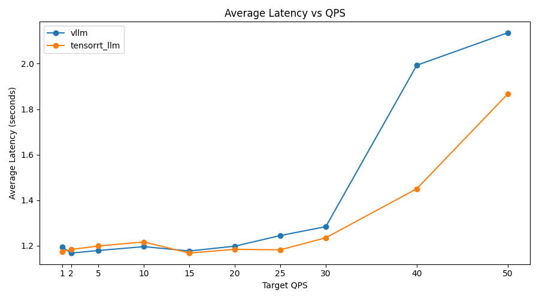

### P95 Latency vs QPS

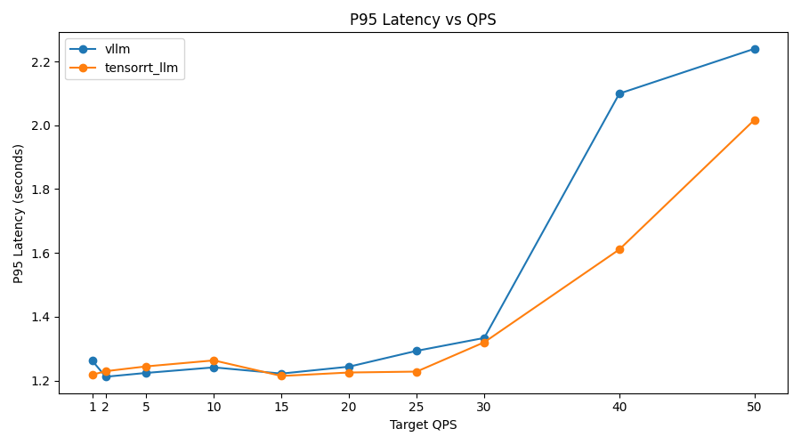

### P99 Latency vs QPS

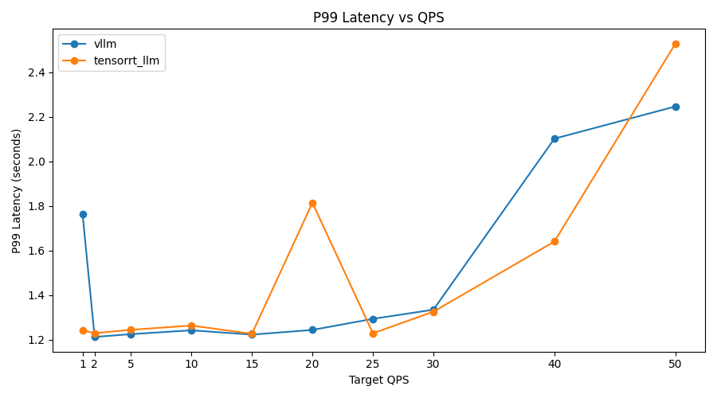

### Throughput vs QPS

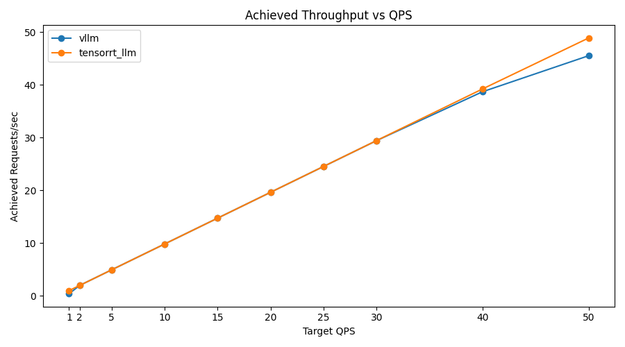

### Token Throughput vs QPS

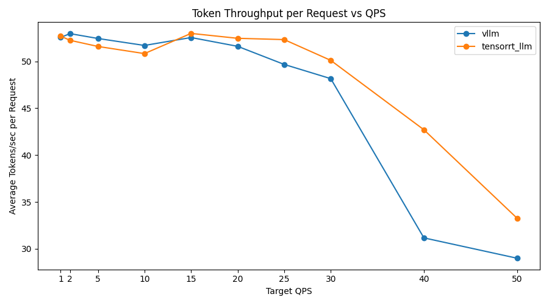

### Success Rate vs QPS

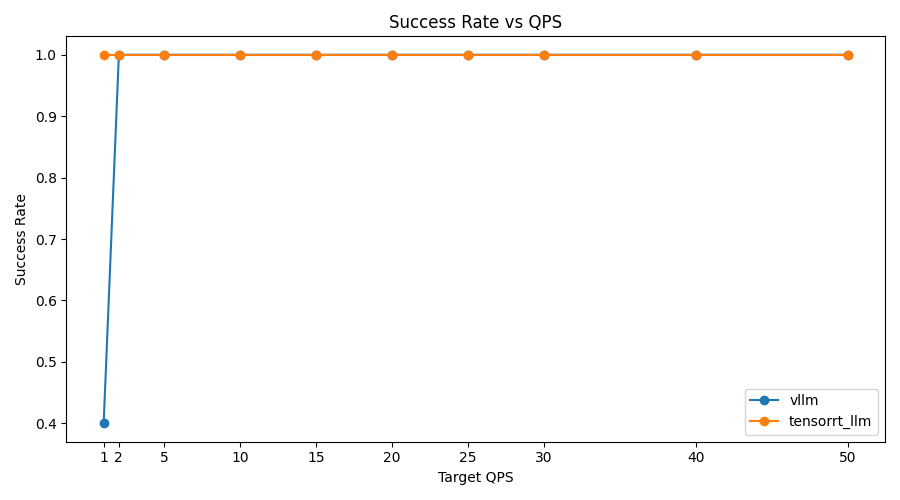

## Phase 5C: Triton + TensorRT-LLM vs vLLM (A100 Production Benchmark)

Phase 5C evaluates a **production-style deployment** using  
**NVIDIA Triton Inference Server + TensorRT-LLM**, compared against vLLM  
on the **same A100 GPU** under identical workload conditions.

---

### Setup

- **GPU:** NVIDIA A100 (80GB)  
- **Model:** `Qwen/Qwen2.5-7B-Instruct`  
- **Output length:** ~64 tokens (aligned across engines)  
- **Test duration:** 60 seconds per QPS level  
- **Engines:**
  - `vllm`
  - `triton_trtllm` (Triton + TensorRT-LLM)

---

## Key Results

### Achieved Throughput (QPS)

| Target QPS | vLLM | Triton (TRT-LLM) |
|-----------|------|------------------|
| 30        | ~29.65 | ~29.63 |
| 40        | ~39.53 | ~36.04 |
| 50        | ~49.38 | ~36.01 |

---

### Average Latency

| QPS | vLLM | Triton |
|-----|------|--------|
| 30  | ~0.73s | ~0.88s |
| 40  | ~0.79s | ~2.05s |
| 50  | ~0.86s | ~2.67s |

---

### Token Throughput

| QPS | vLLM | Triton |
|-----|------|--------|
| 30  | ~83.8 tok/s | ~73.0 tok/s |
| 40  | ~77.8 tok/s | ~32.6 tok/s |
| 50  | ~71.4 tok/s | ~24.7 tok/s |

---

## Key Observations

- Both systems scale **linearly up to ~30 QPS**
- Beyond ~30 QPS:
  - **vLLM maintains stable latency and throughput**
  - **Triton + TensorRT-LLM saturates**, causing:
    - sharp latency increase (2–3×)
    - collapse in token throughput (~73 → ~25 tok/s)

### Maximum sustainable throughput
### Updated Insight

In the initial configuration (Phase 5C), Triton saturated at ~36 QPS due to:

- limited batch size
- insufficient engine capacity
- suboptimal batching strategy

This limitation was resolved in Phase 5D through:

- inflight fused batching
- increased batch size (128)
- larger token capacity

As a result, Triton scaled to ~49 QPS with stable latency and full GPU utilization.

---

## System-Level Insights

This phase highlights **fundamental scheduling differences**:

### vLLM
- continuous batching
- efficient KV-cache scheduling
- smooth degradation under load
- optimized for **high-concurrency LLM serving**

### Triton + TensorRT-LLM
- discrete batching model
- queue-based scheduling
- strong performance under moderate load
- optimized for **production pipelines and multi-model serving**

---

## Key Takeaway

> Under identical A100 hardware and controlled output lengths,  
> In the initial configuration, vLLM outperformed Triton due to better batching efficiency.
> However, after Phase 5D optimization, Triton achieves comparable throughput while maintaining stable latency.

---

## Phase 5C Visualizations

### Average Latency vs QPS
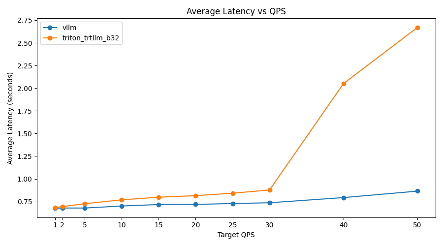

### P95 Latency vs QPS
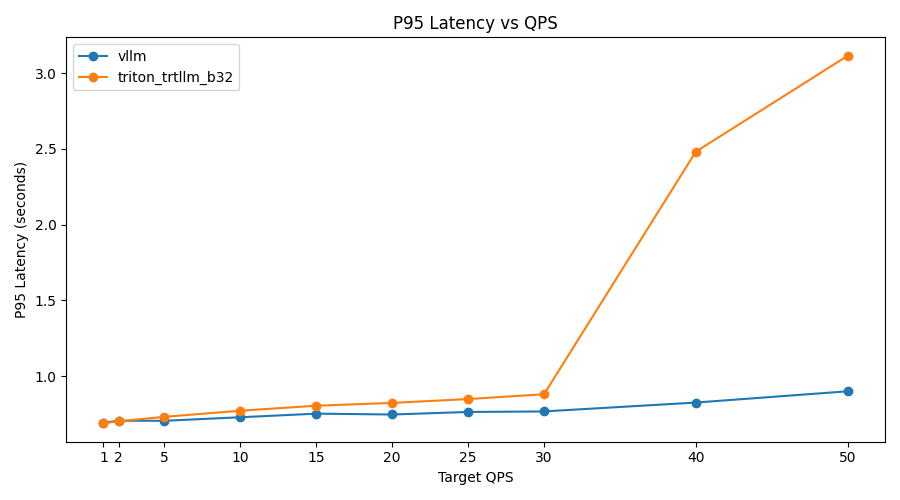

### P99 Latency vs QPS
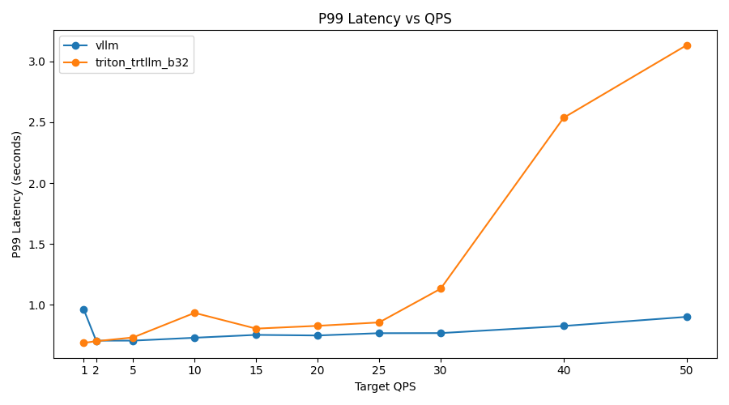

### Throughput vs QPS
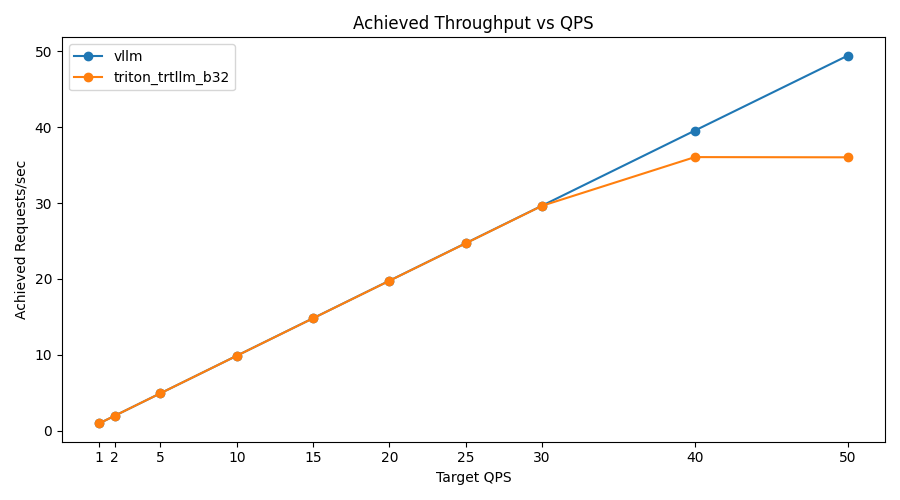

### Token Throughput vs QPS
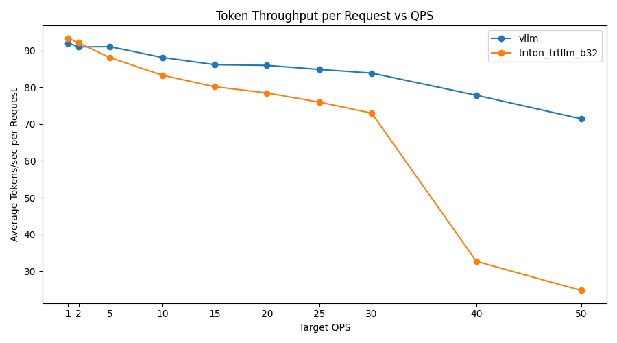

### Success Rate vs QPS
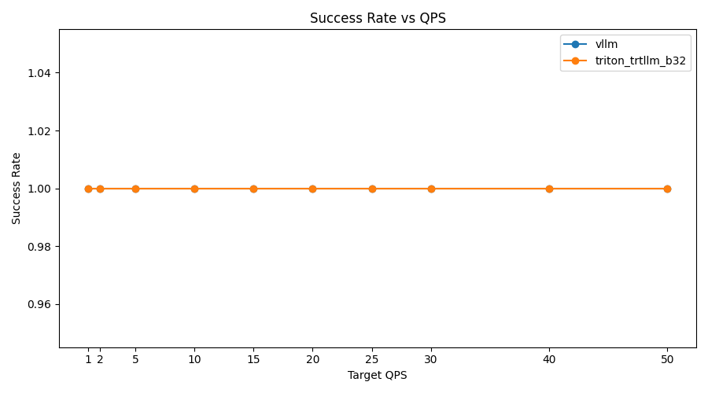

## Phase 5D: Triton Dynamic Batching Optimization (A100)

Phase 5D resolves the performance collapse observed in Phase 5C by optimizing
Triton scheduling and TensorRT-LLM engine configuration.

---

### Objective

- eliminate early saturation (~36 QPS)
- achieve full GPU utilization
- improve throughput and latency stability under load

---

### Key Configuration Changes

#### TensorRT-LLM Engine

- `max_batch_size = 128`
- `max_num_tokens = 8192`
- paged KV cache enabled

#### Triton Configuration

- `batching_strategy = inflight_fused_batching`
- `preferred_batch_size = [128]`
- `max_queue_delay_microseconds = 5000`

---

### Results (A100)

#### Achieved Throughput

| QPS | Phase 5C | Phase 5D |
|-----|----------|----------|
| 40  | ~36      | ~39.5    |
| 50  | ~36      | ~49.3    |

---

#### Average Latency

| QPS | Phase 5C | Phase 5D |
|-----|----------|----------|
| 40  | ~2.05s   | ~0.98s   |
| 50  | ~2.67s   | ~1.06s   |

---

#### GPU Utilization

- ~98–99% utilization during active benchmark
- ~76GB memory usage (weights + KV cache)
- ~290–305W power draw

---

### Key Observations

- Triton no longer collapses beyond ~30 QPS
- Near-linear scaling up to ~50 QPS
- GPU fully saturated under load
- Latency remains stable (~1 second range)

---

### Comparison vs vLLM (A100)

At 50 QPS:

| Metric | vLLM | Triton (5D) |
|--------|------|------------|
| Avg latency | ~0.86s | ~1.06s |
| P99 latency | ~0.90s | ~1.07s |
| Tokens/sec | ~71 | ~60 |
| Success rate | 100% | 100% |

---

### System-Level Insight

Triton performance is highly sensitive to batching and scheduling configuration.

- default configuration → early saturation (~36 QPS)
- optimized configuration → full GPU utilization and stable scaling

This highlights the importance of **dynamic batching and engine capacity tuning**
in production LLM inference systems.

### Critical Insight

Despite achieving similar throughput (~49 QPS), vLLM and Triton differ fundamentally:

- vLLM achieves efficiency through continuous batching and scheduler design
- Triton achieves efficiency through aggressive batching and GPU kernel optimization

This highlights a key trade-off:
- vLLM → lower latency, simpler serving path
- Triton → higher control, production-ready orchestration, but requires tuning

---

## Phase 5D Visualizations

These plots compare vLLM and Triton + TensorRT-LLM (optimized with inflight batching)
under identical A100 hardware and workload conditions.

### Average Latency vs QPS
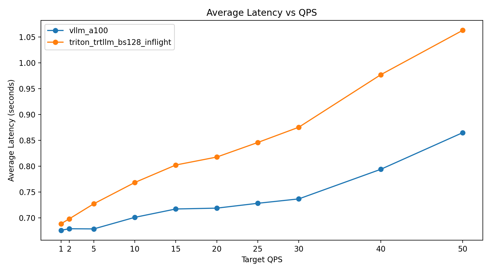

### P95 Latency vs QPS
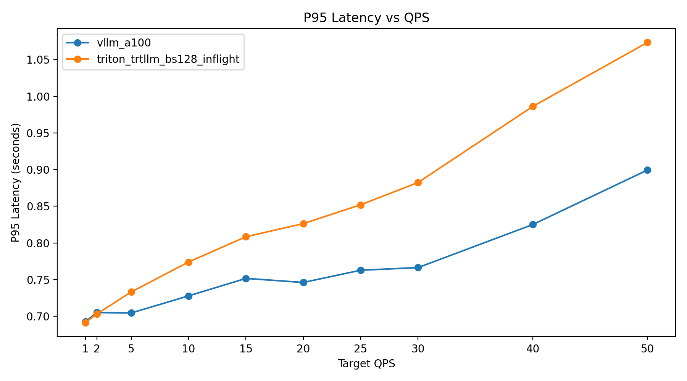

### P99 Latency vs QPS
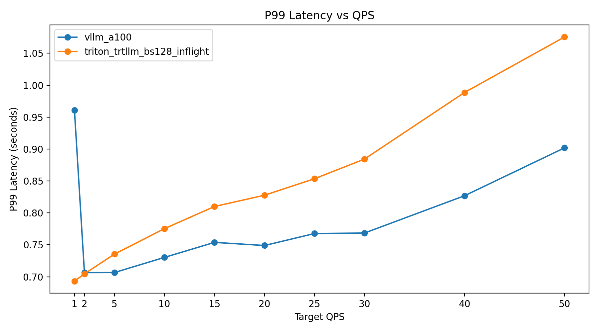

### Throughput vs QPS
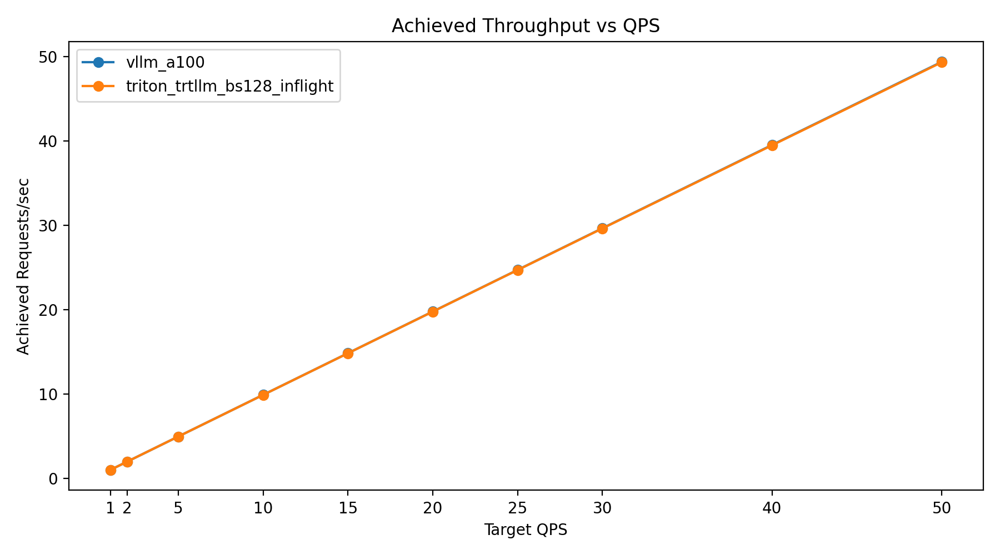

### Token Throughput vs QPS
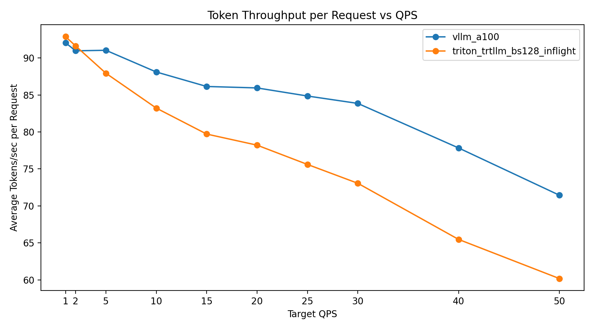

### Success Rate vs QPS
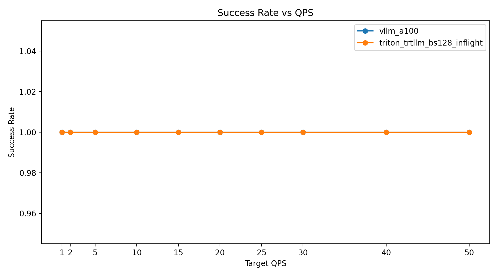

### GPU Utilization During Load

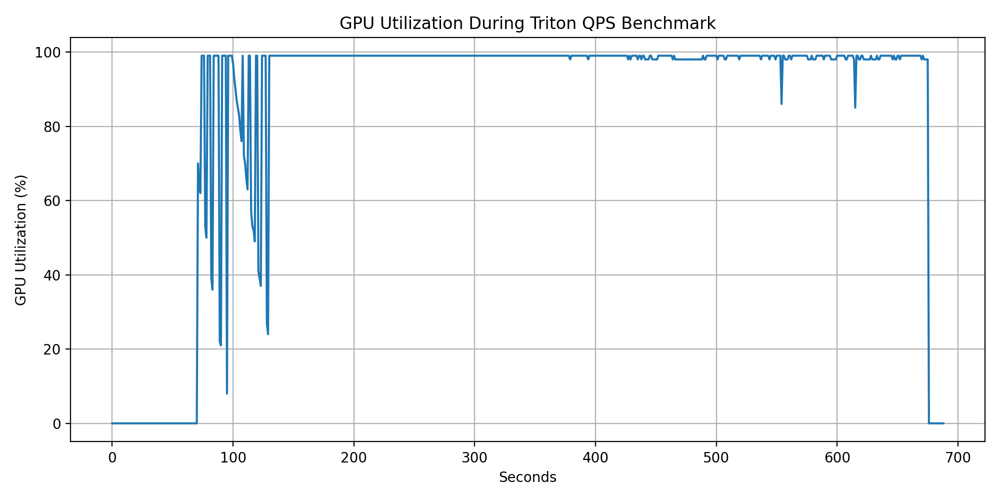

---

## Current Status

The project currently supports:

- local baseline benchmarking
- config-driven benchmark execution
- structured metadata logging
- Hugging Face vs vLLM vs TensorRT-LLM comparison (Phase 3–4)
- production-scale QPS load testing for vLLM (Phase 5A)
- multi-engine load comparison under identical hardware (Phase 5B)
- Triton + TensorRT-LLM production deployment and benchmarking on A100 (Phase 5C)
- system capacity and saturation analysis across multiple serving stacks
- automated cross-engine comparison with visualization outputs
- per-run summaries and reproducible benchmarking artifacts
- Triton dynamic batching optimization and A100 saturation analysis (Phase 5D)
- GPU utilization profiling and correlation with QPS-based load testing

---

## Limitations

While the project now includes Triton-based deployment and cross-engine benchmarking, several limitations remain:

- workload diversity is limited:
  - current benchmarks primarily use fixed output length (~64 tokens)
  - does not yet evaluate long-generation workloads (256–512 tokens)

- Triton dynamic batching has been optimized for high-throughput workloads, but:
  - tuning is workload-dependent
  - further improvements possible for mixed workloads and long-generation tasks

- load patterns are uniform:
  - current QPS benchmarks use steady request rates
  - burst traffic and real-world request variability are not yet simulated

- GPU utilization profiling has been incorporated:
  - nvidia-smi-based logging used to correlate utilization, memory usage, and QPS
  - deeper kernel-level profiling (e.g., Nsight Systems) not yet included

- multi-model and pipeline benchmarking is limited:
  - Triton ensemble capabilities are implemented but not benchmarked extensively

- single-GPU focus:
  - multi-GPU and distributed inference scenarios are not yet explored

---

## Next Planned Improvements

With Phase 5C completed, the next phase focuses on deeper system-level analysis and fair benchmarking across diverse workloads:

### Phase 5D: Workload-Sensitive Benchmarking

- long-output benchmarking:
  - evaluate performance for 256–512 token generation
  - analyze kernel efficiency vs scheduler overhead

- dynamic batching optimization (Triton):
  - tune `max_batch_size`, `preferred_batch_size`, and queue delay
  - study latency vs throughput trade-offs under batching

- burst traffic simulation:
  - implement non-uniform request patterns
  - evaluate batching efficiency under real-world load

- heterogeneous workload testing:
  - mixed prompt lengths and output sizes
  - analyze scheduler robustness across engines

---

### System Profiling

- GPU utilization tracking:
  - integrate `nvidia-smi` / profiling tools
  - correlate utilization with throughput and latency

- memory and KV-cache analysis:
  - study impact of KV-cache growth on performance

---

### Production-Scale Extensions

- Triton ensemble benchmarking:
  - preprocessing → LLM → postprocessing pipelines
  - measure end-to-end latency vs raw model latency

- multi-GPU scaling:
  - evaluate horizontal scaling efficiency
  - benchmark distributed inference setups

- larger models:
  - extend experiments to 13B / 70B models

---

## Summary

This project has evolved into a comprehensive benchmarking framework for modern LLM inference systems, covering both single-request performance and production-scale load behavior.

Across five phases, the project progressed from:

* local baseline benchmarking (Phase 1)
* config-driven experimentation (Phase 2)
* inference engine comparison (Phase 3)
* GPU-optimized multi-engine benchmarking (Phase 4)
* production-scale QPS load testing (Phase 5)

---

## Key Findings

### Phase 4 (RTX 3090 – Single Request)

- TensorRT-LLM achieves the highest and most consistent throughput (~50 tok/s)
- vLLM closely matches TensorRT performance
- Hugging Face baseline is consistently slower (~15–20%)

---

### Phase 5A–5B (RTX 3090 – Load Testing)

- vLLM scales near-linearly up to ~30 QPS
- TensorRT-LLM demonstrates:
  - lower latency under moderate load
  - higher token throughput at higher QPS
- both systems remain stable under sustained load

---

### Phase 5C–5D (A100 – Triton vs vLLM)

- default Triton configuration → early saturation (~36 QPS)
- optimized Triton configuration (Phase 5D):
  - scales to ~49 QPS
  - achieves ~99% GPU utilization
  - maintains ~1s latency under load

**vLLM**
- lower latency (~0.86s at 50 QPS)
- efficient continuous batching

**Triton + TensorRT-LLM**
- requires careful tuning
- competitive throughput when optimized
- full GPU saturation achievable

---

## Final Insight

This project demonstrates that **LLM inference performance is highly workload-dependent**:

- vLLM excels in:
  - high-concurrency, single-model serving
  - dynamic batching and scheduler efficiency

- TensorRT-LLM excels in:
  - optimized GPU execution
  - controlled batching environments
  - production deployment via Triton pipelines

---

## Key Takeaway

> There is no universally “best” inference engine — performance depends on workload characteristics, batching strategy, and serving architecture.

---

## What this project demonstrates

- end-to-end benchmarking of LLM inference systems
- GPU-level performance optimization and analysis
- system capacity and saturation behavior under load
- real-world trade-offs between scheduling and kernel efficiency
- reproducible ML systems experimentation aligned with production scenarios

---

This project reflects real-world ML systems engineering challenges, including:

- inference efficiency vs scalability
- batching and scheduling trade-offs
- latency stability and tail behavior
- production deployment considerations

It provides a strong foundation for work in high-performance inference systems, including Triton deployment, dynamic batching optimization, and large-scale LLM serving infrastructure.